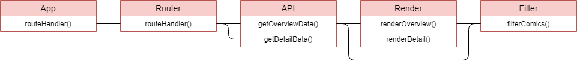
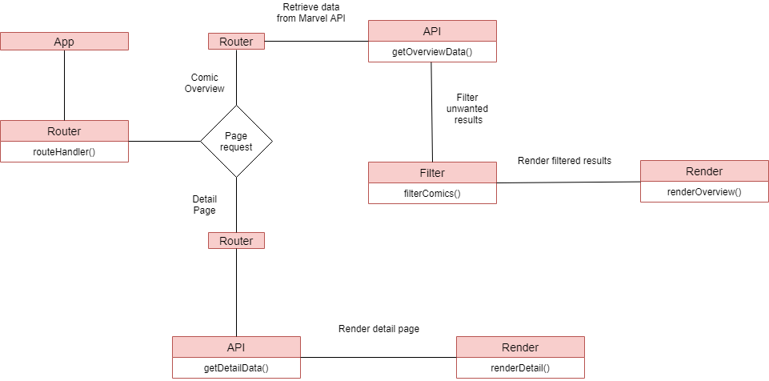

# WAFS1920 | Marvel (Comics) API

Overview of Marvel Comics. The web-app displays the title of each comic, including a thumbnail. Users can search for comics and click on each comic to show more data. Data is retrieved by using the Marvel API.

## Demo Link
[Live link](https://mich97.github.io/web-app-from-scratch-1920/)

## API
This web-app was made by making use of the Marvel API. The Marvel Comics API allows developers everywhere to access information about Marvel's vast library of comics—from what's coming up, to 70 years ago, 3000 calls can be made daily. Documentation can be found [here](https://developer.marvel.com/docs).

## How it works

### Actor Diagram

### Interaction Diagram

## Design Patterns JS
- Arrow functions
- Camel casing
- Tabs to space code
- Occasional but minimal whitespace
- No semicolons
- No 'var'
- ES6

## API Requests
This webapp fetches the following data
- Comic Title
- Comic Thumbnail (path + extension)
- Comic Description

## Wishlist
- [x] Use templating engine to render HTML
- [x] Use routie for routing
- [x] Loading states
- [ ] Display creators of comic on detailpage

## Routie
Routie is a javascript hash routing library. It is designed for scenarios when push state is not an option (IE8 support, static/Github pages, Phonegap, simple sites, etc). It is very tiny (800 bytes gzipped). Routie is used for the home and detailpage routing. Documentation can be found [here](http://projects.jga.me/routie/).

## Transparency
Transparency is a client-side template engine which binds data to DOM. Transparency is current only used to build the detailpage. Documentation can be found [here](https://github.com/leonidas/transparency).